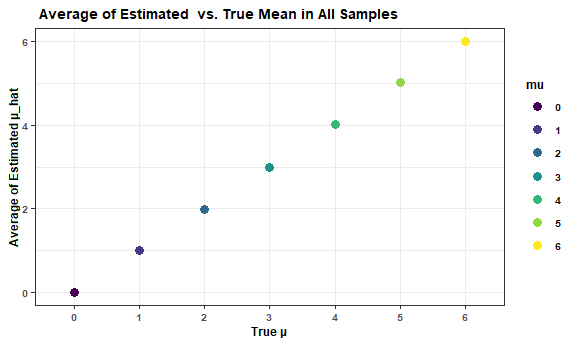
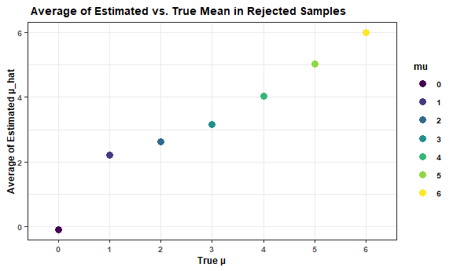
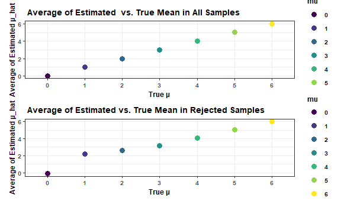

p8105_hw5_qz2266
================
Qing Zhou
2022-11-09

``` r
library(tidyverse)
```

    ## ── Attaching packages ─────────────────────────────────────── tidyverse 1.3.2 ──
    ## ✔ ggplot2 3.3.6      ✔ purrr   0.3.4 
    ## ✔ tibble  3.1.8      ✔ dplyr   1.0.10
    ## ✔ tidyr   1.2.0      ✔ stringr 1.4.1 
    ## ✔ readr   2.1.2      ✔ forcats 0.5.2 
    ## ── Conflicts ────────────────────────────────────────── tidyverse_conflicts() ──
    ## ✖ dplyr::filter() masks stats::filter()
    ## ✖ dplyr::lag()    masks stats::lag()

``` r
library(dplyr)
library(purrr)
library(patchwork)

knitr::opts_chunk$set(
  fig.width = 6,
  fig.asp = .6,
  out.width = "90%"
)
theme_set(theme_minimal() + theme(legend.position = "bottom"))
options(
  ggplot2.continuous.colour = "viridis",
  ggplot2.continuous.fill = "viridis"
)
scale_colour_discrete = scale_color_viridis_d
scale_fill_discrete = scale_fill_viridis_d
```

### Problem 2

``` r
homicide_df = read.csv("data/homicide-data.csv") 
```

``` r
# change date format
homicide = transform(homicide_df, reported_date = as.Date(as.character(reported_date), "%Y%m%d")) %>%   
  
# create a city_state variable
  mutate(city_state = str_c(city, state, sep = ", "))
```

This dataset contains information about 52179 homicides in 51 U.S.
cities in 28 states reported from 2007 to 2017. In each homicide, the
victim’s name, rage, age, and sex are reported, as well as the
disposition for each case.

Note: There are two cities with the name of Tulsa. However, “Tulsa, AL”
has only one data included. It’s possible a mistake in data entry.
Moreover, I checked online but couldn’t find a city called Tulsa in
Alabama. If it’s a typo, then there are only 50 cities in this dataset.

#### Summary of the total number of homicides and the number of unsolved homicides within cities

``` r
homicide_sum = 
homicide %>%
mutate(
    solution = case_when(
      disposition == "Closed without arrest" ~ "unsolved",
      disposition == "Open/No arrest"        ~ "unsolved",
      disposition == "Closed by arrest"      ~ "solved",
    )
  ) %>% 
 select(city_state, solution) %>% 
  
 # filter out the city of Tulsa_AL
 filter(city_state != "Tulsa, AL") 

head(homicide_sum)
```

    ##        city_state solution
    ## 1 Albuquerque, NM unsolved
    ## 2 Albuquerque, NM   solved
    ## 3 Albuquerque, NM unsolved
    ## 4 Albuquerque, NM   solved
    ## 5 Albuquerque, NM unsolved
    ## 6 Albuquerque, NM unsolved

``` r
disposition_city = 
  homicide_sum %>% 
  group_by(city_state) %>% 
  summarize(
    homi_total = n(),
    homi_unsolved = sum(solution == "unsolved"))

disposition_city
```

    ## # A tibble: 50 × 3
    ##    city_state      homi_total homi_unsolved
    ##    <chr>                <int>         <int>
    ##  1 Albuquerque, NM        378           146
    ##  2 Atlanta, GA            973           373
    ##  3 Baltimore, MD         2827          1825
    ##  4 Baton Rouge, LA        424           196
    ##  5 Birmingham, AL         800           347
    ##  6 Boston, MA             614           310
    ##  7 Buffalo, NY            521           319
    ##  8 Charlotte, NC          687           206
    ##  9 Chicago, IL           5535          4073
    ## 10 Cincinnati, OH         694           309
    ## # … with 40 more rows

#### Prop.test for Baltimore, MD

``` r
baltimore_prop = prop.test(
  disposition_city %>% filter(city_state == "Baltimore, MD") %>% pull(homi_unsolved), 
  disposition_city %>% filter(city_state == "Baltimore, MD") %>% pull(homi_total)) %>% 
  broom::tidy()
```

``` r
# pull the estimated proportion and confidence intervals from the tidy dataframe.
tibble(estimate = baltimore_prop %>% pull(estimate),
       conf.low = baltimore_prop %>% pull(conf.low),
       conf.high = baltimore_prop %>% pull(conf.high))
```

    ## # A tibble: 1 × 3
    ##   estimate conf.low conf.high
    ##      <dbl>    <dbl>     <dbl>
    ## 1    0.646    0.628     0.663

#### Prop.test for all cities

``` r
city_prop = 
  disposition_city %>% 
  mutate(
    prop_result = map2(.x = homi_unsolved, .y = homi_total, ~prop.test(x = .x, n = .y)),
    tidy_result = map(.x = prop_result, ~broom::tidy(.x))
  ) %>% 
  select(-prop_result) %>% 
  unnest(tidy_result) %>% 
  select(city_state, estimate, conf.low, conf.high)

head(city_prop)
```

    ## # A tibble: 6 × 4
    ##   city_state      estimate conf.low conf.high
    ##   <chr>              <dbl>    <dbl>     <dbl>
    ## 1 Albuquerque, NM    0.386    0.337     0.438
    ## 2 Atlanta, GA        0.383    0.353     0.415
    ## 3 Baltimore, MD      0.646    0.628     0.663
    ## 4 Baton Rouge, LA    0.462    0.414     0.511
    ## 5 Birmingham, AL     0.434    0.399     0.469
    ## 6 Boston, MA         0.505    0.465     0.545

#### Create a plot that shows the estimates and CIs for each city

``` r
city_prop %>% 
  mutate(city_state = factor(city_state)) %>% 
  mutate(city_state = forcats::fct_reorder(city_state, estimate)) %>% 
  
  ggplot(aes(x = city_state, y = estimate)) +
  geom_point(color = "red") +
  geom_errorbar(aes(ymin = conf.low, ymax = conf.high)) +

  theme(axis.text.x = element_text(angle = 90, hjust = 1, size = rel(0.8))) +
  labs( x = "City_State",
    y = "Estimated proportion of unsolved cases",
    title = "Proportion of Unsolved Homicides in the U.S.")
```


The Plot shows that Chicago, IL was the city with the highest proportion
of unsolved homicide vs. total homicide. There was a nearly 75% homicide
cases unsettled. On the other hand, Richmond, VA has the lowest
proportion among the 50 cities. There was only around 25% cases
unsettled.

### Problem 3

#### Set the function and ttest

``` r
set.seed(1)

sim_nor = function(n = 30, mu = 0, sigma = 5){
  sim_data = tibble(
    x = rnorm(n, mean = mu, sd = sigma))
  ttest = t.test(x = sim_data, conf.level = 0.95) %>%
    broom::tidy() %>%
    select(estimate, p.value)
}
```

#### Set μ=0. Generate 5000 datasets from the model

``` r
sim_mu_0 = rerun(5000, sim_nor(mu = 0)) %>%
  bind_rows()

head(sim_mu_0)
```

    ## # A tibble: 6 × 2
    ##   estimate p.value
    ##      <dbl>   <dbl>
    ## 1    0.412  0.629 
    ## 2    0.664  0.368 
    ## 3    0.551  0.534 
    ## 4    0.567  0.487 
    ## 5   -1.65   0.0599
    ## 6    1.19   0.229

#### Repeat the above for μ={0,1,2,3,4,5,6}

``` r
sim_result =
  tibble(mu = c(0,1,2,3,4,5,6)) %>%
  mutate(output = map(.x = mu, ~rerun(5000, sim_nor(mu = .x))),
         result = map(output, bind_rows)) %>%
  unnest(result) %>% 
  select(-output)

head(sim_result)
```

    ## # A tibble: 6 × 3
    ##      mu estimate p.value
    ##   <dbl>    <dbl>   <dbl>
    ## 1     0    0.520   0.549
    ## 2     0    1.11    0.188
    ## 3     0    1.01    0.220
    ## 4     0   -0.835   0.309
    ## 5     0   -0.892   0.365
    ## 6     0    0.557   0.503

#### Make a plot showing the proportion of times the null was rejected

``` r
power_plot =
  sim_result %>%
  group_by(mu) %>%
  mutate(
    total = n(),
    rej_null = sum(p.value < 0.05),
    power = rej_null/total,
    mu = as.factor(mu)
  ) %>%
  
  ggplot(aes(x = mu, y = power, color = mu)) +
  geom_point(size = 3) +
  
  theme_bw() + theme(text = element_text(face = "bold", size = 13)) +
  labs(
    title = "The Power of the Tests",
    x = "μ",
    y = "Power"
  )

power_plot
```


#### Make a plot showing the average estimate of μ^ and the true value of μ

``` r
total_plot =
  sim_result %>%
  group_by(mu) %>%
  summarize(avg_estimate = mean(estimate)) %>%
  mutate(mu = as.factor(mu)) %>%
  
  ggplot(aes(x = mu, y = avg_estimate, color = mu)) + 
  geom_point(size = 3) +
  
  theme_bw() + theme(text = element_text(face = "bold", size = 13)) +
  labs(
    x = "True μ", 
    y = "Average of Estimated μ_hat", 
    title = " Average of Estimated  vs. True Mean Among All Samples"
  ) 
 
total_plot
```



#### Make a plot of the average estimate of μ^ only in samples for which the null was rejected and the true value of μ

``` r
reject_plot =
  sim_result %>%
  filter(p.value < 0.05) %>%
  group_by(mu) %>%
  summarize(avg_estimate = mean(estimate)) %>%
  mutate(mu = as.factor(mu)) %>%
  
  ggplot(aes(x = mu, y = avg_estimate, color = mu)) + 
  geom_point(size = 3) +
  
  theme_bw() + theme(text = element_text(face = "bold", size = 13)) +
  labs(
    x = "True μ", 
    y = "Average of Estimated μ_hat",
    title = " Average of Estimated Mean vs. True Mean Among Rejected Samples"
  ) 

reject_plot
```



``` r
total_plot + reject_plot
```


